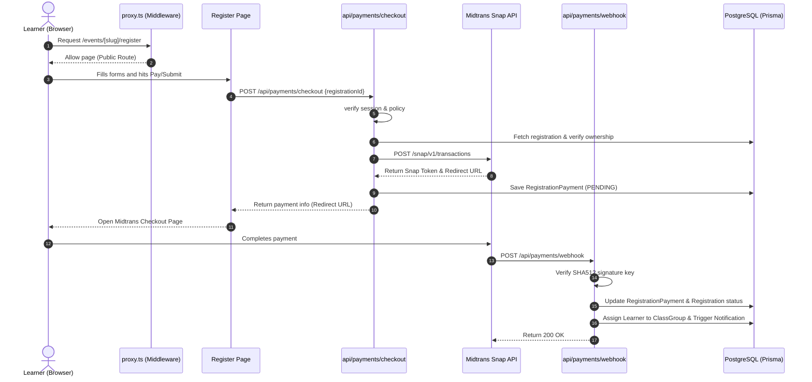

# Architecture

**Analysis Date:** 2026-06-06

## Pattern Overview

**Overall:** Layered Full-stack Next.js Monolith.

**Key Characteristics:**
- **App Router Model:** Separation of Client Components (`"use client"`) and Server Components (default).
- **Relational Data Modeling:** Strongly-typed schema mapped to a PostgreSQL database via Prisma ORM.
- **RBAC Middleware Gating:** Coarse-grained role-based route access controls enforced before page rendering.
- **API Gated Route Handlers:** RESTful endpoint routes with explicit auth/role enforcement policies inside the handlers.
- **Client Cache Synchronization:** State querying and invalidation via TanStack Query (React Query).

## Layers

**Gating Middleware Layer (`src/proxy.ts`):**
- Purpose: intercept incoming page requests and apply coarse authorization filters.
- Contains: Route mapping checks, role-based redirects.
- Depends on: NextAuth session configuration.
- Used by: Next.js middleware loader (mapped from `src/proxy.ts` into Next.js routing execution).

**UI & Component Layer (`src/components/`, `src/app/**/page.tsx`):**
- Purpose: Render pages, layouts, forms, tables, and dashboards.
- Contains:
  - Shared UI Primitives: `src/components/ui/` (buttons, dialogs, inputs, labels, cards).
  - Portal-Specific Elements: e.g. `src/components/admin/`, `src/components/finance/`, `src/components/learner/`.
  - Providers composition: `src/components/providers.tsx`.
- Depends on: Client-side fetching helpers (`src/lib/api.ts`), custom contexts.

**API Route Handler Layer (`src/app/api/**/route.ts`):**
- Purpose: Process HTTP requests (GET, POST, PUT, DELETE) and return structured JSON responses.
- Contains: Route-level authentication checks, query parsing, business logic invocation, and audit logs writing.
- Depends on: Prisma Client singleton (`src/lib/db.ts`), Auth utilities (`src/lib/auth-utils.ts`), observability wrappers (`src/lib/observability/route.ts`).

**Data Layer / ORM (`src/lib/db.ts`, `prisma/schema.prisma`):**
- Purpose: Interface with the PostgreSQL database.
- Contains: Schema configuration, index settings, model relations, migration histories, and the Prisma client singleton.
- Used by: Route handlers and Prisma seed scripts.

**Service & Domain Logic Layer (`src/lib/`):**
- Purpose: Encapsulate domain operations.
- Contains:
  - `src/lib/payment.ts` - Midtrans API request builders and webhooks verifying.
  - `src/lib/domain/payment-workflow.ts` - Order generation and database record lifecycle.
  - `src/lib/instructor-scope.ts` - Resolving course/class scopes for instructors.
  - `src/lib/notifications.ts` - Sending/recording system notifications.
  - `src/lib/upload-security.ts` - Upload constraints and filters.
- Used by: API route handlers.

## Data Flow

### 1. Public Event Registration & Payment Flow



### 2. Protected Admin User Retrieval Flow

1. Admin clicks User Management in dashboard.
2. Next.js fetches user list via `GET /api/admin/users?page=1`.
3. Handler executes `requireRole("ADMIN")` check. If not admin, returns `403 Forbidden` early.
4. If admin, route execution runs within the `withRequestObservability` wrapper.
5. Handler queries database via `prisma.user.findMany(...)` with skip/take offsets.
6. Handler builds paginated JSON payload.
7. Observability captures event statistics; response is returned to browser.

## Key Abstractions

**Route Gating & Security Policies:**
- `requireRole(...)` / `requireAuth()` (`src/lib/auth-utils.ts`): Server-side policy helper for route controllers.
- `requireApiAuthPolicy(...)` (`src/lib/route-policy.ts`): Declarative request policy checker that enforces same-origin constraints, CSRF protection, rate limits, and roles in one call.

**Observability Wrapper:**
- `withRequestObservability(...)` (`src/lib/observability/route.ts`): Orchestrates API request context propagation, performance profiling (p95 tracking), and automatic exception instrumentation.

**Domain Handlers:**
- `getInstructorScope(...)` (`src/lib/instructor-scope.ts`): Resolves database queries constraints for instructors so they only view learners and modules associated with classes they teach.

## Entry Points

**Page Middleware:**
- Location: `src/proxy.ts`
- Triggers: On every page route navigation.
- Responsibilities: Redirect unauthenticated requests to `/login`, redirect authenticated users to their respective home portals based on roles.

**API Controllers:**
- Location: `src/app/api/**/route.ts`
- Triggers: Fetch calls from browser components.
- Responsibilities: Validate inputs, call domain services, execute CRUD on Prisma, and return standard JSON outputs.

## Error Handling

**Strategy:** early returns for auth/validation issues, exception bubbling within logic paths caught by the observability boundaries.

**Patterns:**
- **Validation check early return:**
  ```typescript
  if (!email || !password) {
      return NextResponse.json({ error: "Required fields missing" }, { status: 400 });
  }
  ```
- **Observability encapsulation:**
  `withRequestObservability` executes an inner handler, logs errors via `errorMonitor.record(err)`, and formats generic `500 Internal Server Error` responses to prevent internal database traces from leaking to clients.

## Cross-Cutting Concerns

**Authentication:**
- Managed via `NextAuth` Credentials flow. Cookie-stored sessions mapped to JWT tokens containing user ID, email, role, and profile details.

**Observability & Log Auditing:**
- System metrics logged to standard output. High-impact operational changes write audit records (`AuditLog` model) in the database for tracking user/admin actions.

**Input Validation:**
- Schema requirements validated at route boundaries. Custom file-upload filters (`src/lib/upload-security.ts`) inspect magic numbers, extensions, and file sizes.

---

*Architecture analysis: 2026-06-06*
*Update when major patterns change*
