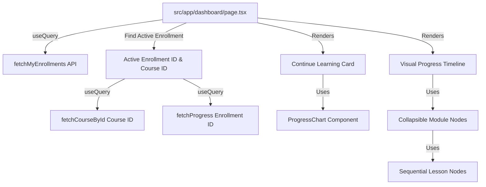

# Phase 5: Learner Dashboard Visual Progress & Timeline - Research
Researched: 2026-06-07
Domain: Learner Dashboard UI, Progress Tracking, Component Styling
Confidence: HIGH

## Summary
The goal of Phase 5 is to implement two core enhancements to the Learner Dashboard (`src/app/dashboard/page.tsx`) mapping to requirements **LEARN-02** and **LEARN-03**:
1. **Continue Learning Card**: A prominent dashboard banner that displays the currently active course title, progress bar, estimated duration, and details of the next incomplete lesson, alongside a circular progress chart and a "Resume Course" button.
2. **Visual Progress Timeline (Vertical Node Connector Map)**: An interactive vertical map of modules and lessons represented as connected nodes on the dashboard. It must show sequential status flows (Completed, Up Next, and Locked/Pending) and support collapsible modules, with the active module expanded by default.

This research details the codebase structure, state-of-the-art visual styling, precise status mapping logic, fallback rules, and common pitfalls to ensure a flawless implementation.

---

## Architectural Responsibility Map


- **Frontend Controller**: `src/app/dashboard/page.tsx` initiates queries to load user enrollments, fetches course details, and handles timeline state (e.g., expanded/collapsed modules).
- **Reusable Primitives**: `src/components/learner/dashboard-visuals.tsx` hosts `ProgressChart` (circular progress).
- **APIs and Services**: Reuses existing frontend fetch wrapper functions in `src/features/client/api/learner.ts` re-exported from `src/lib/api.ts` (`fetchCourseById`, `fetchProgress`, `fetchMyEnrollments`).
- **Database Access / API Routes**:
  - `/api/enrollments` handles enrollment retrieval.
  - `/api/courses/[id]` returns course content structure (modules and lessons).
  - `/api/progress/[enrollmentId]` verifies event approval and returns lesson statuses.

---

## Standard Stack
- **Next.js 16.2 App Router** (`next`) `[VERIFIED: npm registry]` - Handles routing, layout nesting, and page definitions.
- **React 19.2** (`react`, `react-dom`) `[VERIFIED: npm registry]` - Core view library.
- **Tailwind CSS v4** (`tailwindcss`) `[VERIFIED: npm registry]` - Utility-first styling engine.
- **Prisma Client** (`@prisma/client`) `[VERIFIED: npm registry]` - Type-safe database queries.
- **Lucide React** (`lucide-react`) `[VERIFIED: npm registry]` - Vector iconography (e.g., `Video`, `HelpCircle`, `FileText`, `CheckCircle2`, `Clock`, `ChevronDown`, `ChevronRight`, `PlayCircle`).
- **React Query** (`@tanstack/react-query`) `[VERIFIED: npm registry]` - Async state/cache manager for frontend requests.

---

## Package Legitimacy Audit
No new packages are needed for this phase. All required tools are already installed:
- `lucide-react` (0.562.0) `[VERIFIED: npm registry]` - Used for timeline icons.
- `@tanstack/react-query` (5.90.21) `[VERIFIED: npm registry]` - Used for client-side fetching.
- `recharts` (3.7.0) `[VERIFIED: npm registry]` - Used inside `ProgressChart`.

---

## Architecture Patterns
1. **Sequential Flow Gating & Status Mapping**: Lessons within a course have a defined sequence across modules. The timeline determines a lesson's state (Completed, Up Next, or Locked) relative to the first incomplete lesson index.
2. **Glassmorphism & Micro-Interactions**: Visual timeline design mimics premium LMS layouts, providing clear node connectors, hover glows, and subtle transformations.
3. **Optimized Client State / React Query Caching**: Since `fetchCourseById` and `fetchProgress` are cached globally under React Query, requesting them on the dashboard and inside the course reader is fast and does not result in redundant API requests.

---

## Don't Hand-Roll
- **Do not hand-roll SVG charts**: Reuse `ProgressChart` from `src/components/learner/dashboard-visuals.tsx` for displaying completion percentages.
- **Do not manually fetch auth cookies/session data**: Reuse the `useUser` hook from `src/lib/context/user-context.tsx`.
- **Do not hardcode UI animations**: Use standard Tailwind CSS transitions (e.g. `transition-all duration-200`) and classes for collapsibility.

---

## Runtime State Inventory
*(N/A - This phase introduces visual features and does not perform database schema migrations or state renaming.)*

---

## Common Pitfalls
1. **Divided-by-Zero Errors in Completion calculation**: If a course is created without any modules or lessons, calculations for completion percentages or sequence maps will crash. Ensure checks like `allLessons.length > 0` are in place.
2. **Asynchronous Initial Collapsed State Flickering**: Initializing collapsible modules to all collapsed or all expanded can cause flickering when the course query data arrives. Using a derived default state model (e.g., `collapsedModules[module.id] ?? (module.id !== activeModuleId)`) solves this without requiring synchronizing `useEffect` hooks.
3. **Invalid Date Formatting Crash**: If `completedAt` or `enrolledAt` are invalid date strings or null, parsing with `new Date()` can throw errors or display `"Invalid Date"`. Implement fallback safeguards.
4. **Stale Progress Queries**: When a learner resumes a course and completes a lesson, returning to the dashboard should display the updated progress. Ensure query key invalidation is correctly handled when completing lessons (`["progress", enrollment.id]`, `["my-enrollments"]`, `["dashboard-stats"]` are invalidated).

---

## Code Examples

### 1. Safely Computing the Next Incomplete Lesson & Last Active Date
```typescript
// Flattening lessons in sequence
const allLessons = useMemo(() => {
    if (!courseData?.course) return [];
    return courseData.course.modules.flatMap((m) => m.lessons);
}, [courseData]);

// Find the next incomplete lesson
const nextIncompleteLesson = useMemo(() => {
    const completedSet = new Set(
        progressData?.progresses?.filter((p) => p.isCompleted).map((p) => p.lessonId) ?? []
    );
    return allLessons.find((l) => !completedSet.has(l.id)) || null;
}, [allLessons, progressData]);

// Extracting Last Active Date
const lastActiveDate = useMemo(() => {
    if (!progressData?.progresses || progressData.progresses.length === 0) {
        return activeEnrollment?.enrolledAt ? new Date(activeEnrollment.enrolledAt) : null;
    }
    const completedProgresses = progressData.progresses.filter(
        (p) => p.isCompleted && p.completedAt
    );
    if (completedProgresses.length === 0) {
        return activeEnrollment?.enrolledAt ? new Date(activeEnrollment.enrolledAt) : null;
    }
    const latestTimestamp = Math.max(
        ...completedProgresses.map((p) => new Date(p.completedAt!).getTime())
    );
    return new Date(latestTimestamp);
}, [progressData, activeEnrollment]);

const formattedLastActive = useMemo(() => {
    if (!lastActiveDate) return null;
    return lastActiveDate.toLocaleDateString("id-ID", {
        day: "numeric",
        month: "long",
        year: "numeric",
    });
}, [lastActiveDate]);
```

### 2. Collapsible Module Hook-free Defaulting
```typescript
const [collapsedModules, setCollapsedModules] = useState<Record<string, boolean>>({});

const toggleModule = (moduleId: string) => {
    setCollapsedModules((prev) => ({
        ...prev,
        [moduleId]: !(prev[moduleId] ?? (moduleId !== activeModuleId)),
    }));
};

const isModuleCollapsed = (moduleId: string) => {
    return collapsedModules[moduleId] ?? (moduleId !== activeModuleId);
};
```

---

## State of the Art
- **Premium Glassmorphic Layout**: Continue Learning Card uses gradient borders and soft shadow glows matching the Justitia premium dark/light layout themes.
- **Subway/Timeline Connectors**: Vertical lines (`border-l-2 border-dashed`) link lesson nodes, giving learners an immediate visual sense of a "learning path" rather than a disjointed checklist.

---

## Assumptions Log
- `[ASSUMED]` Sourcing the "last active" date from the latest `completedAt` timestamp of `Progress` is sufficient for tracking recent user engagement.
- `[ASSUMED]` Active enrollment refers specifically to the enrollment record with status `ACTIVE`.
- `[ASSUMED]` The visual timeline on the dashboard represents the currently active enrollment's course structure. If no enrollment is active, the timeline is hidden.

---

## Open Questions
- **Handling Completed Courses**: If a course is 100% complete, what should the Continue Learning Card show?
  - *Recommendation*: Render a success/completion card stating "All lessons completed!" and encouraging them to claim their certificate, rather than trying to look for a "next lesson" which is `null`.

---

## Environment Availability
- PostgreSQL database runs in local Docker Compose `[VERIFIED: codebase]`.
- All routes and components run on Next.js 16/React 19 under `npm run dev` `[VERIFIED: package.json]`.

---

## Validation Architecture
- **Visual Smoke Test**: Verify alignment of split layout elements in dark and light modes. Check collapsibility behavior on the vertical timeline.
- **Vitest Unit Verification**: Write unit tests verifying next incomplete lesson extraction, fallback to enrollment date, and timeline sequence rendering logic.

---

## Security Domain
- Course reader and progress routes independently execute auth and registration approval checks via `requireAuth()` and `getCourseLifecycleAccess(...)` in `src/app/api/progress/[enrollmentId]/route.ts`. The dashboard fetches from these secure endpoints, ensuring data integrity.

---

## Project Constraints (from GEMINI.md)
- **Tech Stack**: Next.js 16.2 App Router, React 19, TypeScript 5, Prisma ORM, PostgreSQL, Vitest.
- **Access Gating**: All protected API route handlers must independently enforce role gating using helper scopes.
- **Naming Conventions**: kebab-case for all files (e.g. `dashboard-visuals.tsx`), camelCase for local variables and functions.

---

## Sources
- `src/app/dashboard/page.tsx` `[VERIFIED: codebase]`
- `src/app/learn/[courseId]/page.tsx` `[VERIFIED: codebase]`
- `.planning/phases/05-learner-dashboard-visual-progress-timeline/05-CONTEXT.md` `[VERIFIED: codebase]`
- `GEMINI.md` `[VERIFIED: codebase]`

---

## Metadata
- **Author**: Research Subagent
- **Phase**: 05
- **Status**: Completed Research
