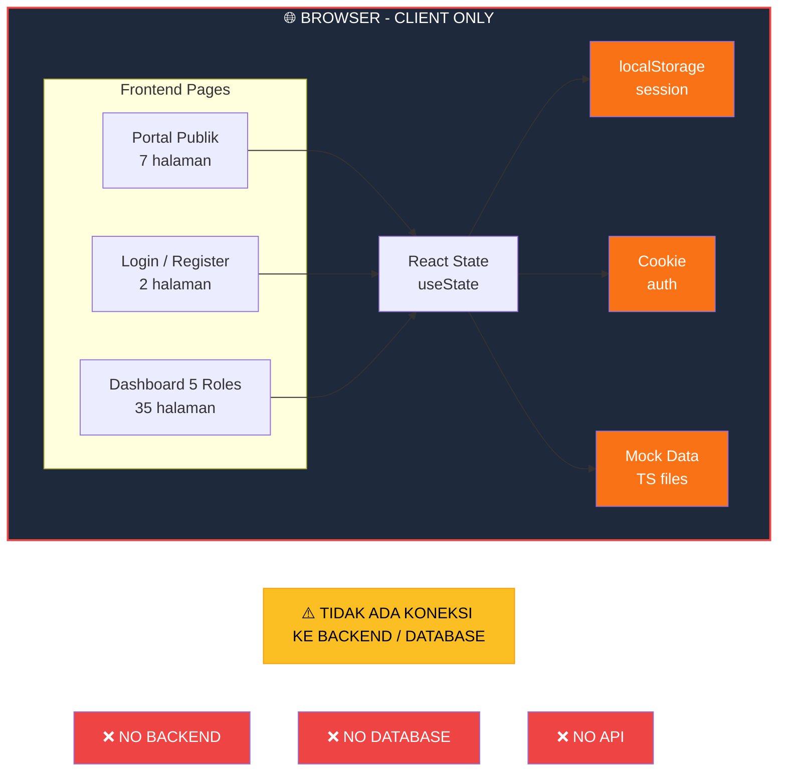
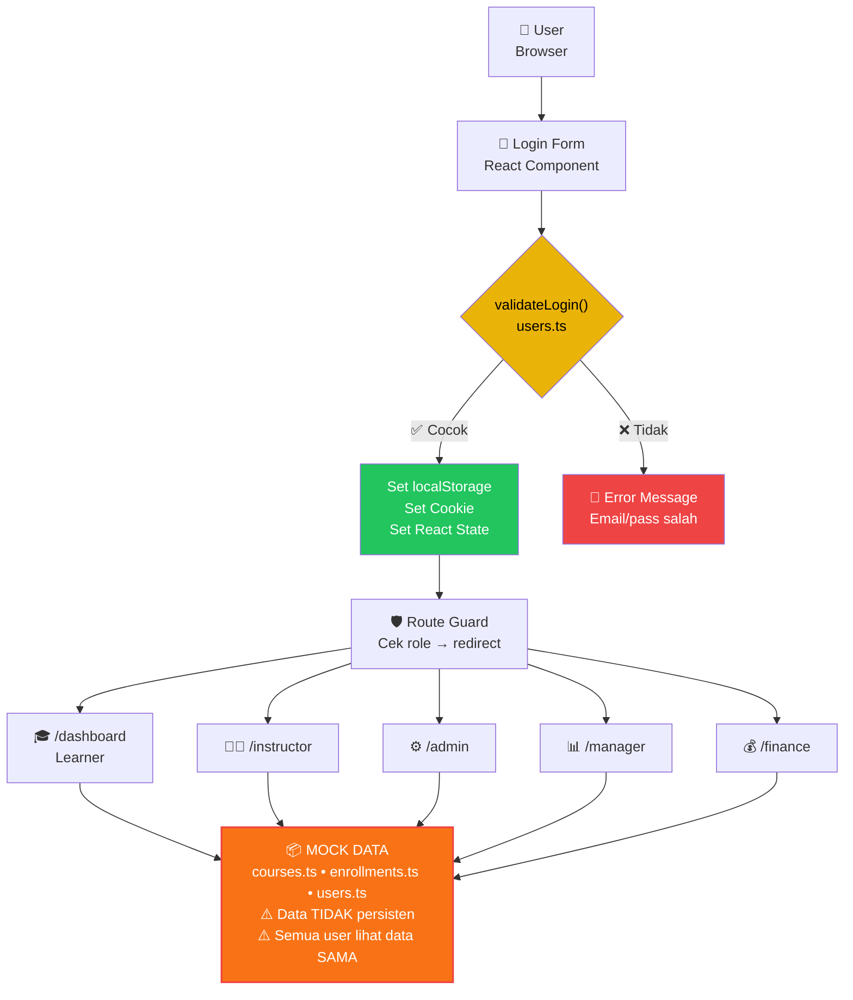
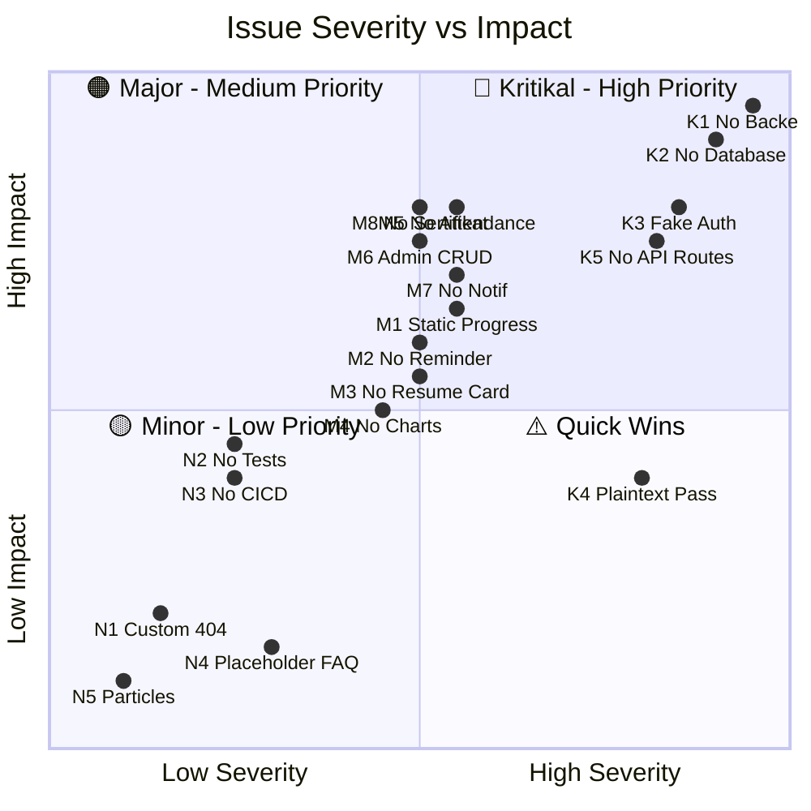
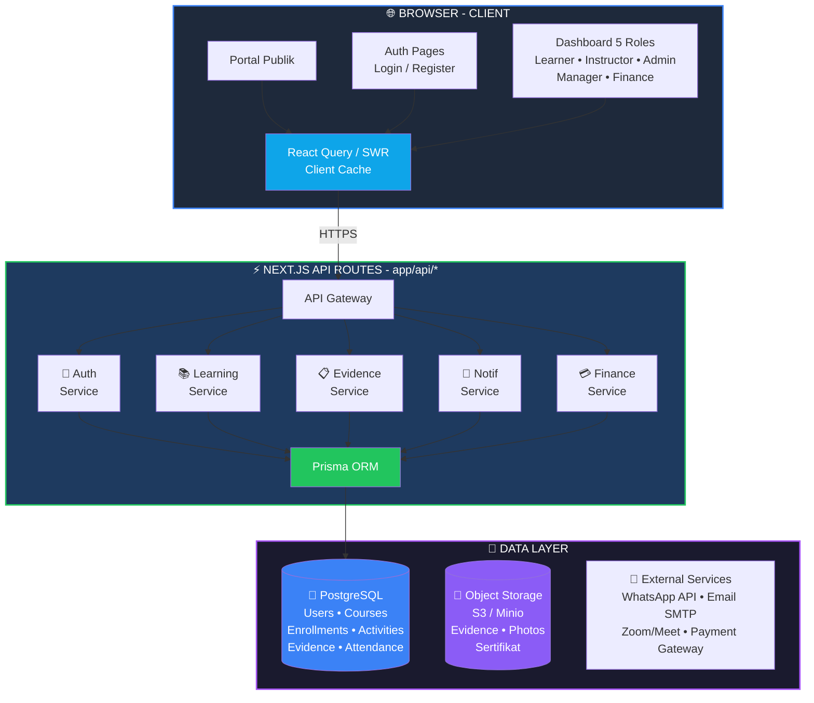
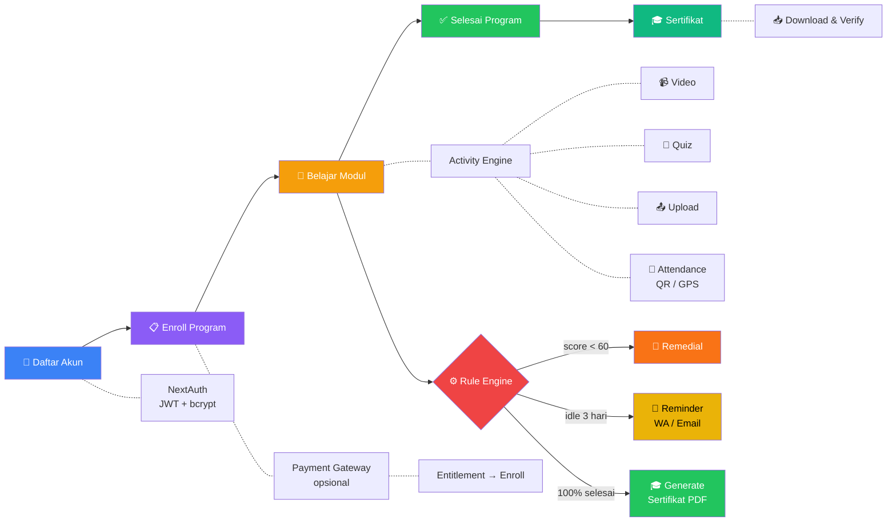

# ASSESSMENT REPORT — LMS RENJANA
## Review Sistem Existing, Daftar Issue & Rekomendasi

**Versi:** 1.0  
**Tanggal:** 28 Februari 2026  
**PIC:** IT + Business  
**Fase:** 1 — Assessment / Review Existing

---

## 1. Ringkasan Eksekutif

Dokumen ini merangkum hasil assessment terhadap sistem LMS Renjana yang sudah berjalan (AS-IS). Tujuannya adalah mengidentifikasi kondisi saat ini, masalah yang ditemukan (issue & pain points), serta rekomendasi untuk pengembangan di Fase 2.

**Kesimpulan utama:** Sistem saat ini merupakan **frontend-only prototype** yang sudah memiliki struktur UI yang lengkap (5 console/portal + halaman publik), namun **belum memiliki backend, database, maupun otentikasi yang sesungguhnya**. Seluruh data bersifat mock/hardcoded di sisi client.

### Struktur Direktori Proyek

```
renjana/
├── src/
│   ├── app/                          # Next.js App Router (44 pages)
│   │   ├── page.tsx                  # Landing Page
│   │   ├── login/                    # Auth
│   │   ├── register/
│   │   ├── about-us/                 # Portal Publik
│   │   ├── courses/
│   │   ├── course/[id]/
│   │   ├── career/
│   │   ├── contact/
│   │   ├── news-and-publications/
│   │   ├── learn/[courseId]/          # Learning Page
│   │   ├── dashboard/                # 🎓 Learner (7 pages)
│   │   │   ├── actions/
│   │   │   ├── activity/[id]/
│   │   │   ├── checkin/
│   │   │   ├── evidence/
│   │   │   ├── feedback/
│   │   │   └── settings/
│   │   ├── instructor/               # 👨‍🏫 Instructor (5 pages)
│   │   │   ├── learners/[id]/
│   │   │   ├── feedback/
│   │   │   └── attendance/
│   │   ├── admin/                    # ⚙️ Admin (11 pages)
│   │   │   ├── programs/[id]/ + new/
│   │   │   ├── activities/ + new/
│   │   │   ├── enrollments/[id]/ + new/
│   │   │   ├── locations/ + new/
│   │   │   └── audit/
│   │   ├── manager/                  # 📊 Manager (5 pages)
│   │   │   ├── skills/
│   │   │   ├── risks/
│   │   │   ├── impact/
│   │   │   └── modality/
│   │   └── finance/                  # 💰 Finance (5 pages)
│   │       ├── transactions/
│   │       ├── invoices/
│   │       ├── refunds/
│   │       └── pricing/
│   ├── components/                   # 35 komponen
│   │   ├── ui/                       # shadcn/ui (18)
│   │   ├── auth/                     # Login, Register, RouteGuard
│   │   ├── dashboard/                # Header, Sidebar, StatCard
│   │   ├── instructor/
│   │   ├── admin/
│   │   ├── manager/
│   │   ├── finance/
│   │   └── course/
│   └── lib/
│       ├── data/                     # ⚠️ Mock data (hardcoded)
│       │   ├── users.ts              # User + password PLAINTEXT
│       │   ├── courses.ts            # 13KB data kursus
│       │   ├── enrollments.ts        # Data enrollment
│       │   └── index.ts              # Stats helpers
│       ├── context/
│       │   └── user-context.tsx       # ⚠️ Auth via localStorage
│       └── i18n/
│           └── translations.ts       # ✅ ID/EN
├── docs/                             # Dokumentasi
├── Dockerfile                        # ✅ Docker support
├── docker-compose.yml
└── package.json
```

---

## 2. Kondisi AS-IS (Sistem Saat Ini)

### 2.1 Tech Stack

| Komponen | Teknologi | Versi |
|----------|-----------|-------|
| Framework | Next.js (App Router) | 16.1.6 |
| Bahasa | TypeScript | 5.x |
| UI Library | React | 19.2.3 |
| Styling | Tailwind CSS | 4.x |
| Komponen UI | shadcn/ui + Radix UI | Terbaru |
| Animasi | Framer Motion | 12.x |
| Ikon | Lucide React | 0.562 |
| Tema | next-themes | 0.4.6 |
| Deployment | Docker + Docker Compose | — |

### Arsitektur Sistem AS-IS



### 2.2 Inventaris Halaman (44 Pages)

#### Portal Publik (7 halaman)
| Halaman | Route | Status |
|---------|-------|--------|
| Landing Page | `/` | ✅ Ada |
| About Us | `/about-us` | ✅ Ada |
| Courses Catalog | `/courses` | ✅ Ada |
| Course Detail | `/course/[id]` | ✅ Ada |
| Career | `/career` | ✅ Ada |
| News & Publications | `/news-and-publications` | ✅ Ada |
| Contact | `/contact` | ✅ Ada |

#### Autentikasi (2 halaman)
| Halaman | Route | Status |
|---------|-------|--------|
| Login | `/login` | ✅ Ada (mock) |
| Register | `/register` | ✅ Ada (mock) |

#### Learner Dashboard (7 halaman)
| Halaman | Route | Status |
|---------|-------|--------|
| Dashboard Home | `/dashboard` | ✅ Ada |
| Actions Queue | `/dashboard/actions` | ✅ Ada |
| Activity Detail | `/dashboard/activity/[id]` | ✅ Ada |
| Check-in | `/dashboard/checkin` | ✅ Ada |
| Evidence | `/dashboard/evidence` | ✅ Ada |
| Feedback | `/dashboard/feedback` | ✅ Ada |
| Settings | `/dashboard/settings` | ✅ Ada |

#### Learning Page (1 halaman)
| Halaman | Route | Status |
|---------|-------|--------|
| Learn Course | `/learn/[courseId]` | ✅ Ada |

#### Instructor Console (5 halaman)
| Halaman | Route | Status |
|---------|-------|--------|
| Dashboard | `/instructor` | ✅ Ada |
| Learners List | `/instructor/learners` | ✅ Ada |
| Learner Detail | `/instructor/learners/[id]` | ✅ Ada |
| Feedback | `/instructor/feedback` | ✅ Ada |
| Attendance | `/instructor/attendance` | ✅ Ada |

#### Admin Control Plane (11 halaman)
| Halaman | Route | Status |
|---------|-------|--------|
| Dashboard | `/admin` | ✅ Ada |
| Programs | `/admin/programs` | ✅ Ada |
| Program Detail | `/admin/programs/[id]` | ✅ Ada |
| New Program | `/admin/programs/new` | ✅ Ada |
| Activities | `/admin/activities` | ✅ Ada |
| New Activity | `/admin/activities/new` | ✅ Ada |
| Enrollments | `/admin/enrollments` | ✅ Ada |
| Enrollment Detail | `/admin/enrollments/[id]` | ✅ Ada |
| New Enrollment | `/admin/enrollments/new` | ✅ Ada |
| Locations | `/admin/locations` | ✅ Ada |
| Audit Log | `/admin/audit` | ✅ Ada |

#### Manager Dashboard (5 halaman)
| Halaman | Route | Status |
|---------|-------|--------|
| Dashboard | `/manager` | ✅ Ada |
| Skills | `/manager/skills` | ✅ Ada |
| Risks | `/manager/risks` | ✅ Ada |
| Impact | `/manager/impact` | ✅ Ada |
| Modality | `/manager/modality` | ✅ Ada |

#### Finance Console (5 halaman)
| Halaman | Route | Status |
|---------|-------|--------|
| Dashboard | `/finance` | ✅ Ada |
| Transactions | `/finance/transactions` | ✅ Ada |
| Invoices | `/finance/invoices` | ✅ Ada |
| Refunds | `/finance/refunds` | ✅ Ada |
| Pricing | `/finance/pricing` | ✅ Ada |

### 2.3 Komponen (35 komponen)

| Kategori | Jumlah | Contoh |
|----------|--------|--------|
| UI Generik | 18 | Button, Card, Input, Label, Toast, Skeleton |
| Dashboard | 4 | Header, Sidebar, StatCard, ActionCard |
| Auth | 3 | LoginForm, RegisterForm, RouteGuard |
| Instructor | 3 | InstructorSidebar, CohortCard, LearnerCard |
| Admin | 1 | AdminSidebar |
| Finance | 1 | FinanceSidebar |
| Manager | 1 | ManagerSidebar |
| Course | 2 | CourseCard, CourseDetail |
| Demo | 1 | DemoComponent |
| Provider | 1 | ThemeProvider |

### 2.4 Data Layer

| File | Isi | Keterangan |
|------|-----|------------|
| `lib/data/users.ts` | Data user + validateLogin | **Hardcoded** — password plaintext |
| `lib/data/courses.ts` | Data kursus | **Hardcoded** — 13KB mock data |
| `lib/data/enrollments.ts` | Data enrollment | **Hardcoded** |
| `lib/data/index.ts` | Stats helpers | Computed dari mock data |
| `lib/context/user-context.tsx` | Auth context | **localStorage** + cookie, bukan JWT |
| `lib/i18n/translations.ts` | Terjemahan ID/EN | ✅ Berfungsi |

### Alur Data Saat Ini (AS-IS Flow)



### 2.5 Fitur yang Sudah Berfungsi

| Fitur | Status | Catatan |
|-------|--------|--------|
| Navigasi multi-console | ✅ | 5 console sesuai peran |
| Dark/Light theme | ✅ | Tersimpan di browser |
| Multi-bahasa (ID/EN) | ✅ | Tersimpan di browser |
| Login/Logout simulasi | ⚠️ | Mock — bukan otentikasi sungguhan |
| Role-based routing | ⚠️ | Client-side only — mudah di-bypass |
| Landing page publik | ✅ | Responsif dan menarik |
| WhatsApp widget | ✅ | Floating button |
| Docker deployment | ✅ | Dockerfile + docker-compose.yml |

---

## 3. Daftar Issue & Pain Points

### 3.1 Issue Kritikal (🔴 Harus Segera Ditangani)

| # | Issue | Dampak | Area |
|---|-------|--------|------|
| K1 | **Tidak ada backend/API** — seluruh data hardcoded di frontend | Tidak bisa menyimpan data apapun secara persisten | Arsitektur |
| K2 | **Tidak ada database** — tidak ada PostgreSQL atau DB lainnya | Data hilang saat deploy/refresh | Data Layer |
| K3 | **Otentikasi palsu** — login hanya mencocokkan email/password dari file TypeScript, disimpan di localStorage | Keamanan nol; siapapun bisa bypass | Security |
| K4 | **Password plaintext** — disimpan dalam source code | Pelanggaran keamanan dasar | Security |
| K5 | **Tidak ada API routes** — Next.js App Router belum dimanfaatkan untuk backend | Tidak bisa integrasi dengan sistem lain | Backend |

### 3.2 Issue Major (🟠 Perlu Ditangani di Fase 2)

| # | Issue | Dampak | Area |
|---|-------|--------|------|
| M1 | **Progress hanya angka/statik** — tidak ada visual timeline atau milestone | Learner sulit memahami posisi belajar | Dashboard User |
| M2 | **Tidak ada reminder otomatis** "lanjutkan modul" | Engagement peserta rendah | Engagement |
| M3 | **Tidak ada Continue Learning Card** yang dinamis + status modul | UX kurang engaging | Dashboard User |
| M4 | **Laporan hanya angka** — tidak ada grafik tren | Manager sulit menganalisis | Reporting |
| M5 | **Tidak ada sistem absensi/evidence** yang terintegrasi | Kehadiran tidak bisa diverifikasi | Attendance |
| M6 | **Daftar peserta admin** belum fungsional (CRUD mock) | Admin tidak bisa mengelola data | Admin |
| M7 | **Notifikasi belum ada** — tidak ada sistem push/email/WA | User tidak dapat informasi real-time | Notification |
| M8 | **Sertifikat belum bisa di-generate** | Alur pembelajaran tidak tuntas | Learner |

### 3.3 Issue Minor (🟡 Nice to Have)

| # | Issue | Dampak | Area |
|---|-------|--------|------|
| N1 | Halaman error/404 sudah ada tapi belum di-custom per konsol | UX tidak konsisten | UX |
| N2 | Belum ada unit test atau e2e test | Kualitas kode sulit dijaga | Testing |
| N3 | Belum ada CI/CD pipeline (GitHub Actions) | Deployment manual | DevOps |
| N4 | FAQ di landing page masih ada placeholder ("xx, xx") | Kesan tidak profesional | Content |
| N5 | Particle effects di landing page berat untuk perangkat lemah | Performa | Performance |

### Ringkasan Issue (Severity Map)



---

## 4. Rekomendasi untuk Fase 2

### 4.1 Prioritas 1 — Fondasi Backend (Wajib)

| # | Rekomendasi | Detail |
|---|-------------|--------|
| R1 | **Buat API Layer** | Gunakan Next.js API Routes (`app/api/`) atau NestJS terpisah |
| R2 | **Setup Database** | PostgreSQL + Prisma ORM sebagai data layer |
| R3 | **Otentikasi sesungguhnya** | NextAuth.js / Auth.js dengan JWT + bcrypt hashing |
| R4 | **Migrasi data mock ke DB** | Buat seed script dari data existing |

### 4.2 Prioritas 2 — Enhancement Dashboard (Sesuai Timeline)

| # | Rekomendasi | Detail |
|---|-------------|--------|
| R5 | **Visual timeline/milestone** di dashboard | Progress bar → visual journey map |
| R6 | **Continue Learning Card** | Quick-resume widget dengan status modul |
| R7 | **Reminder otomatis** | Email/WA/push notification untuk modul belum selesai |
| R8 | **Grafik tren per program** | Chart.js atau Recharts untuk reporting manager |
| R9 | **Identitas user ditambahkan** | Profile lengkap (foto, bio, NIK, jabatan) |

### 4.3 Prioritas 3 — Admin & Operasional

| # | Rekomendasi | Detail |
|---|-------------|--------|
| R10 | **CRUD peserta fungsional** | Admin bisa kelola data real user |
| R11 | **Absensi & evidence** | QR code check-in, upload foto, GPS |
| R12 | **Generate sertifikat** | PDF generation otomatis setelah selesai |
| R13 | **Export data (CSV/Excel)** | Download daftar peserta, laporan kegiatan |

### 4.4 Prioritas 4 — Infrastruktur & DevOps

| # | Rekomendasi | Detail |
|---|-------------|--------|
| R14 | **CI/CD Pipeline** | GitHub Actions untuk auto-build & deploy |
| R15 | **Testing** | Jest + Playwright untuk unit & e2e |
| R16 | **Monitoring & logging** | Sentry untuk error tracking |

### Arsitektur TO-BE (Target Fase 2)



### Alur Pembelajaran TO-BE (Target)



---

## 5. Peta Fitur AS-IS vs TO-BE

| Fitur | AS-IS (Saat Ini) | TO-BE (Fase 2) |
|-------|-------------------|----------------|
| Data Storage | Hardcoded TS files | PostgreSQL + Prisma |
| Authentication | Mock (localStorage) | NextAuth + JWT + bcrypt |
| User Dashboard | Angka statik | Visual timeline + milestone |
| Progress | Number only | Visual journey + % + chart |
| Reminder | ❌ Tidak ada | ✅ Email/WA/Push |
| Continue Card | ❌ Tidak ada | ✅ Smart resume widget |
| Absensi | ❌ Mock | ✅ QR + GPS + Foto |
| Sertifikat | ❌ Tidak ada | ✅ Auto-generate PDF |
| Reporting | Angka saja | Grafik tren + export |
| Admin CRUD | Mock | Full CRUD via API |
| Notifikasi | ❌ Tidak ada | ✅ Real-time |
| CI/CD | ❌ Manual | ✅ GitHub Actions |
| Testing | ❌ Tidak ada | ✅ Unit + E2E |

---

## 6. Catatan Penutup

Sistem existing sudah memiliki **fondasi frontend yang baik** — struktur halaman lengkap, desain menarik, i18n, dan arsitektur komponen yang rapi. Hal ini mempercepat pengembangan Fase 2 karena **tidak perlu rebuild UI dari nol**.

Fokus utama Fase 2 adalah **membangun backend dan menghubungkan UI existing ke data layer yang sesungguhnya**, serta menambahkan fitur-fitur kunci yang saat ini masih missing (reminder, visual timeline, sertifikat, absensi).

> **Business Note:** PIC Business (tim RENJANA / IKAFH UNDIP) harus menyiapkan konten kursus, template sertifikat, dan SOP absensi sebagai input untuk development.

---

*Dokumen ini merupakan output dari Fase 1 (Assessment / Review Existing) sesuai Timeline Renjana.*
