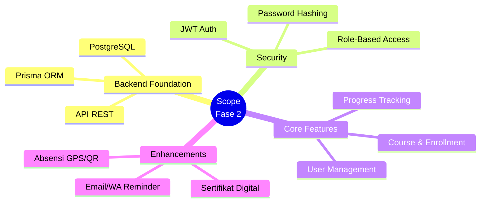
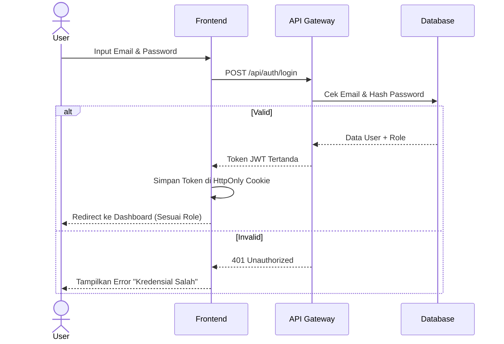
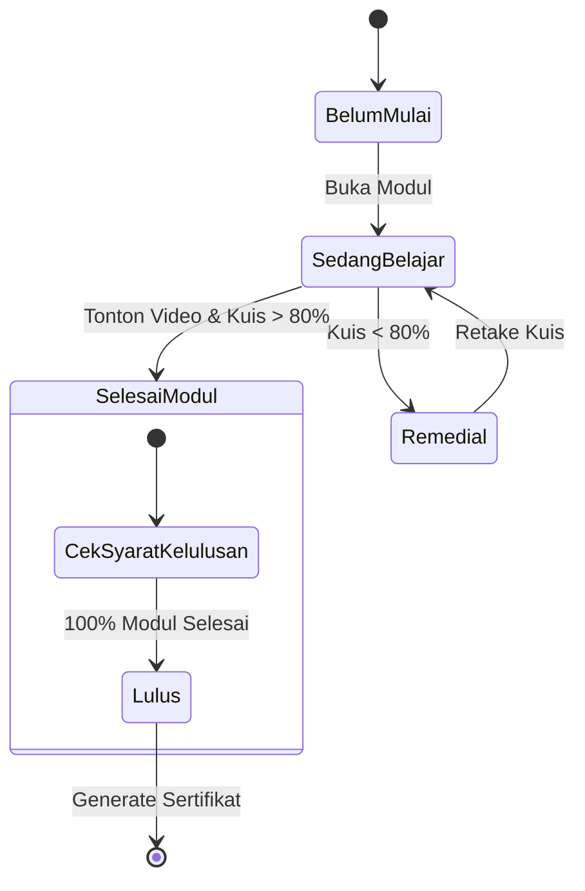

# Business Requirement Document (BRD) & Functional Requirement Document (FRD)
**Project:** Renjana Learning Management System (Fase 2)
**Date:** 28 Februari 2026
**Status:** Draft

---

## 1. Pendahuluan
### 1.1 Tujuan Dokumen
Dokumen ini bertujuan untuk mendefinisikan ruang lingkup (scope), kebutuhan bisnis (Business Requirements), dan kebutuhan fungsional (Functional Requirements) untuk **Fase 2** pengembangan platform Renjana LMS. Dokumen ini disusun berdasarkan temuan dari document *01_Assessment_Report*.

### 1.2 Latar Belakang
Pada Fase 1, prototipe frontend aplikasi telah berhasil dibangun menggunakan Next.js dan Tailwind CSS, mencakup seluruh halaman antarmuka (UI) untuk 5 peran pengguna (Learner, Instructor, Admin, Manager, Finance). 

Namun, sistem saat ini bersifat *frontend-only* tanpa terhubung ke database dan backend yang sesungguhnya. Seluruh data masih menggunakan *mock data*. Oleh karena itu, fokus Fase 2 adalah membangun **fondasi backend yang kokoh** dan mengintegrasikannya dengan UI yang sudah ada, serta menambahkan beberapa fitur prioritas untuk meningkatkan nilai guna aplikasi.

---

## 2. Ruang Lingkup (Scope) Fase 2
Ruang lingkup Fase 2 difokuskan pada transisi dari prototipe menjadi sistem fungsional yang siap pakai (MVP - Minimum Viable Product) dengan data yang persisten.

### Visualisasi Scope (Mindmap)

**In-Scope:**
1. Pembangunan API Layer (REST atau GraphQL).
2. Perancangan dan implementasi Database Relasional (PostgreSQL).
3. Implementasi sistem Autentikasi dan Otorisasi (JWT & Role-Based Access Control).
4. Pembuatan fungsi CRUD inti (Pengguna, Program/Kursus, Enrollment).
5. Pengembangan fitur krusial yang hilang di Fase 1: Manajemen Absensi/Kehadiran, Reminder Otomatis, dan Generate Sertifikat.
6. Integrasi Frontend (UI Fase 1) dengan Backend baru.

**Out-of-Scope (Direncanakan untuk Fase 3+):**
1. Integrasi Payment Gateway (Midtrans/Xendit) untuk pembelian kursus mandiri.
2. Fitur Live Video Conference di dalam sistem.
3. Aplikasi Mobile Native (iOS/Android).
4. Advanced Analytics & Machine Learning AI Recommendations.

---

## 3. Business Requirements Document (BRD)
Bagian ini menjelaskan kebutuhan dari perspektif bisnis penyelenggara pelatihan (IKAFH UNDIP / Renjana).

| ID | Fitur/Kebutuhan | Deskripsi Bisnis | Prioritas |
|---|---|---|---|
| **BR-01** | **Manajemen Identitas (SSO/Auth)** | Sistem harus memastikan hanya pengguna terdaftar yang dapat mengakses portal sesuai dengan perannya secara aman (Tidak boleh ada password plaintext). | ⭐ Tinggi |
| **BR-02** | **Keamanan Data Persisten** | Semua data pendaftaran, progres belajar, dan aktivitas peserta harus disimpan dengan aman dan permanen di database, tidak hilang saat sesi browser ditutup. | ⭐ Tinggi |
| **BR-03** | **Kelancaran Operasional Admin** | Staf pengelola (Admin) harus bisa menambah, mengubah, dan menghapus data program pelatihan, jadwal, dan peserta secara mandiri melalui *Admin Console* tanpa perbaikan kode. | ⭐ Tinggi |
| **BR-04** | **Transparansi Progres Belajar** | Peserta (Learner) harus bisa melihat progres studinya secara visual (milestone) untuk meningkatkan retensi dan motivasi penyelesaian kursus. | 🔵 Sedang |
| **BR-05** | **Manajemen Kehadiran Otomatis** | Pengajar (Instructor) dan Admin membutuhkan sistem kehadiran terpusat yang bisa diverifikasi silang (misal dengan bukti foto atau lokasi GPS) untuk menjaga integritas sertifikasi. | 🔵 Sedang |
| **BR-06** | **Otomatisasi Penerbitan Sertifikat** | Sistem harus dapat menerbitkan Sertifikat Kelulusan berupa PDF secara otomatis bagi peserta yang telah mencapai syarat kelulusan program (skor tugas, kehadiran penuh). | 🔵 Sedang |
| **BR-07** | **Peningkatan Tingkat Kelulusan (Reminder)** | Sistem harus meminimalisasi *drop-out* dengan mengirimkan notifikasi pengingat otomatis (Email/WhatsApp) kepada peserta yang lama tidak mengakses modul. | 🔵 Sedang |

---

## 4. Functional Requirements Document (FRD)
Bagian ini menerjemahkan kebutuhan bisnis menjadi fitur teknis yang harus dikembangkan oleh tim developer.

### 4.1 Modul Autentikasi & Keamanan (AUTH-M)

**Alur Otentikasi Terpusat:**

| ID FR | Deskripsi Fungsionalitas | Kriteria Penerimaan (Acceptance Criteria) |
|---|---|---|
| **FR-AUTH-01** | Sistem Otentikasi JWT | - Menggunakan standard JSON Web Token (JWT) untuk session. - Password disimpan di database dalam bentuk hash (bcrypt/argon2). |
| **FR-AUTH-02** | Role-Based Access Control (RBAC) | - Route guard backend dan frontend memastikan Learner tidak bisa membuka endpoint `/api/admin/*`. - Data response difilter berdasarkan role pengguna. |
| **FR-AUTH-03** | Halaman Login & Registrasi | - Integrasi dengan komponen UI `LoginForm` dan `RegisterForm` yang ada. |

### 4.2 Modul Manajemen Data Inti (DATA-M)
| ID FR | Deskripsi Fungsionalitas | Kriteria Penerimaan (Acceptance Criteria) |
|---|---|---|
| **FR-DATA-01** | API Manajemen Pengguna (CRUD) | - Endpoint untuk `GET`, `POST`, `PUT`, `DELETE` tabel `Users`. - Dashboard Admin > Users terhubung ke API ini. |
| **FR-DATA-02** | API Manajemen Kelas/Program (CRUD) | - Endpoint untuk tabel `Courses` dan relasinya (Modul, Materi). - Admin bisa membuat/mengedit kelas. |
| **FR-DATA-03** | API Manajemen Enrollment | - Endpoint mencatat user A mendaftar di kelas B. - Dashboard Learner menampilkan course berdasarkan data tabel `Enrollments`. |

### 4.3 Modul Pengalaman Belajar (LRN-M)

**State Diagram: Siklus Modul Pembelajaran**

| ID FR | Deskripsi Fungsionalitas | Kriteria Penerimaan (Acceptance Criteria) |
|---|---|---|
| **FR-LRN-01** | Tracker Progres Tersimpan | - Setiap user klik materi, persentase progres di-update dan disimpan ke DB. - *Continue Learning Card* di home menampilkan bab terakhir. |
| **FR-LRN-02** | Sistem Kehadiran (Check-In) | - Tombol "Check-in" di Dashboard Learner menyimpan log waktu dan kelas. - Frontend meminta izin lokasi (GPS koordinat). |
| **FR-LRN-03** | Unggah Dokumen Bukti (Evidence) | - Endpoint `multipart/form-data` untuk terima file gambar/PDF. - File disimpan di cloud storage (S3 bucket komersial atau folder lokal), url disimpan di DB. |
| **FR-LRN-04** | Generator Sertifikat PDF | - API yang merender HTML template sertifikat menjadi file PDF ([nama]+[id]). |

### 4.4 Modul Operasional & Notifikasi (OPS-M)
| ID FR | Deskripsi Fungsionalitas | Kriteria Penerimaan (Acceptance Criteria) |
|---|---|---|
| **FR-OPS-01** | Dashboard Analytics Manager | - Data yang disajikan (Skills, Risks, Modalitas) bersifat dinamis diambil dari fungsi agregasi/Query Group By. |
| **FR-OPS-02** | Scheduler / Crontab Reminder | - *Background worker* berjalan 1x sehari pukul 08:00 WIB. - Jika (Hari Ini - Tanggal Terakhir Aktivitas >= 3 hari), trigger pengiriman notifikasi/log table. |

---

## 5. Non-Functional Requirements (NFR)
Kebutuhan teknis agar sistem beroperasi dengan handal dan mudah di-*maintenance*:

1. **Reliability & Availability**: Aplikasi harus stabil berjalan menggunakan *Docker containers*.
2. **Performance**: API response time di bawah rata-rata <500ms untuk query non-reporting.
3. **Maintanability**: Menggunakan ORM (*Prisma* direkomendasikan karena kompatibilitas dengan ekosistem TypeScript/Next.js).
4. **Data Security**: Backup rotasi database setidaknya 1x per 24 jam.
5. **Linting & Code Quality**: Tidak boleh ada *any* properties di code TypeScript yang baru ditulis; Linter CI harus Passed sebelum *Merge Request*.

---

## 6. Asumsi dan Dependensi
1. **Infrastruktur Eksternal**: Penyediaan server (VPS) yang sudah terinstal Docker dan layanan SMTP untuk email/WA di luar lingkup developer (disiapkan oleh tim operasional IKAFH).
2. **Ketersediaan Konten**: Modul materi, kuis, dan desain template master sertifikat (kosong) disediakan oleh Subject Matter Expert.

---

### Tanda Tangan Persetujuan
Dengan dicetaknya dan ditandatanganinya dokumen ini, maka seluruh pihak menyetujui *Scope of Work* untuk pengembangan Fase 2.

| Pihak | Representatif (Peran) | Tanggal | Tanda Tangan |
|---|---|---|---|
| Klien Pemilik Bisnis | [Nama & Jabatan] | ......... | ......... |
| Project Manager | [Nama & Jabatan] | ......... | ......... |
| Tim Pengembang | [Nama & Jabatan] | ......... | ......... |
