# Solution Design Document (SDD) & Wireframes
**Project:** Renjana Learning Management System (Fase 2)
**Date:** 28 Februari 2026
**Status:** Draft

---

## 1. Pendahuluan
Dokumen ini menguraikan arsitektur teknis, desain database, struktur API, dan rancangan antarmuka (Wireframe) untuk implementasi **Fase 2** sesuai dengan kebutuhan yang didefinisikan dalam dokumen *02_BRD_FRD_Phase2*.

---

## 2. Arsitektur Sistem (Target Fase 2)
Sistem akan menggunakan pendekatan **Monolithic Modern** memanfaatkan fitur full-stack dari Next.js App Router.

### 2.1 C4 Model - Container Diagram

```mermaid
flowchart TD
    %% Define Actors
    U_Learner((👤 Learner))
    U_Admin((⚙️ Admin))
    U_Instruct((👨‍🏫 Instructor))

    %% Define External System
    EXT_Mail[["📧 SMTP / WA API<br/>(External Notif)"]]

    %% Define Renjana System
    subgraph System ["Renjana LMS"]
        direction TB
        WebApp["🖥️ Web Application<br/>(Next.js, UI)"]
        API["⚡ API Layer<br/>(Route Handlers)"]
        DB[("🗄️ PostgreSQL DB<br/>(Prisma ORM)")]
        Storage[("📁 Object Storage<br/>(S3 / MinIO)")]
        
        WebApp -->|HTTP Requests| API
        API -->|Read/Write| DB
        API -->|Upload/Get| Storage
    end

    %% Define Relationships
    U_Learner -->|Akses Panel| WebApp
    U_Admin -->|Kelola Data| WebApp
    U_Instruct -->|Akses Dashboard| WebApp
    
    API -->|Trigger Peringatan| EXT_Mail

    %% Styling
    style System fill:#f8fafc,stroke:#94a3b8,stroke-width:2px,stroke-dasharray: 5 5
    style WebApp fill:#0ea5e9,color:#fff,stroke:#0284c7
    style API fill:#22c55e,color:#fff,stroke:#16a34a
    style DB fill:#3b82f6,color:#fff,stroke:#2563eb
    style Storage fill:#8b5cf6,color:#fff,stroke:#7c3aed
```

---

## 3. Desain Database (Entity Relationship Diagram)
Database akan menggunakan PostgreSQL yang dikelola melalui Prisma ORM.

---

## 4. Desain API (RESTful Endpoints)
API akan diimplementasikan di folder `src/app/api/` menggunakan Next.js Route Handlers.

### 4.1 Authentication & Profile
| Method | Endpoint | Deskripsi | Auth Required |
|---|---|---|---|
| `POST` | `/api/auth/login` | Menerima email/password, mengembalikan JWT cookie | No |
| `POST` | `/api/auth/logout` | Melakukan clear cookie JWT | Yes |
| `GET` | `/api/users/me` | Mengambil profile user yang sedang login | Yes |

### 4.2 Courses & Learning
| Method | Endpoint | Deskripsi | Auth Required |
|---|---|---|---|
| `GET` | `/api/courses` | List semua kursus (bisa difilter) | Yes |
| `GET` | `/api/courses/[id]` | Detail kursus dan kurikulumnya | Yes |
| `POST` | `/api/enrollments` | Mendaftar ke sebuah kursus | Yes (Learner) |
| `PUT` | `/api/progress/[lessonId]` | Menandai lesson selesai / update skor | Yes (Learner) |

---

## 5. Wireframes (Desain UI Baru)
Sebagian besar UI sudah dikembangkan di Fase 1. Namun, ada beberapa komponen baru yang perlu dibuat di Fase 2 berdasarkan BRD.

### 5.1 Wireframe: Continue Learning Card (Dashboard Learner)
Komponen ini akan diletakkan di paling atas `src/app/dashboard/page.tsx` untuk memudahkan *resume* kelas.

  <h3 style="margin-top: 0; display: flex; align-items: center; gap: 8px;">📚 Lanjutkan Belajar Anda</h3>
  

    

      
Kursus: Dasar Pemrograman Web

      
Modul Terakhir: Pengenalan HTML5

    

    <button style="background-color: #2563eb; color: white; border: none; padding: 10px 20px; border-radius: 6px; font-weight: bold; cursor: pointer;">Lanjutkan 👉</button>
  

  

    

  

  
50% Selesai

### 5.2 Wireframe: Attendance Form (Check-In Modal)
Muncul saat Learner mengklik tombol "Check In" pada modul yang mewajibkan absensi tatap muka/sinkron.

  

    <h3 style="margin: 0; font-size: 18px;">📍 Form Absensi Kehadiran</h3>
  

  

    
Lokasi Anda saat ini:

    

      🌍 Mengambil koordinat GPS... (Izinkan Akses Lokasi)
    

    
Bukti Kehadiran (Opsional):

    

      📤 Klik untuk Upload Foto Selfie Anda
    

  

  

    <button style="border: 1px solid #cbd5e1; background: white; padding: 8px 16px; border-radius: 6px; cursor: pointer;">Batal</button>
    <button style="background-color: #0ea5e9; color: white; border: none; padding: 8px 16px; border-radius: 6px; font-weight: bold; cursor: pointer;">✓ Submit Kehadiran</button>
  

### 5.3 Wireframe: Certificate Viewer (PDF Render)
Tampilan saat peserta mengklik tombol "Download Sertifikat".

  <h3 style="margin-top: 0;">🎓 Sertifikat Kelulusan</h3>
  
  

    <h1 style="color: #0f172a; margin: 0; font-size: 24px;">CERTIFICATE OF COMPLETION</h1>
    
This is to certify that

    <h2 style="color: #2563eb; margin: 0;">Nama Peserta Pelatihan</h2>
    
has successfully completed

    <h3 style="color: #0f172a; margin: 0;">Dasar Pemrograman Web</h3>
    
Date: 28 Feb 2026

  

  
  

    <button style="background-color: #10b981; color: white; border: none; padding: 10px 20px; border-radius: 6px; font-weight: bold; cursor: pointer;">⬇️ Download PDF</button>
    <button style="background-color: #0077b5; color: white; border: none; padding: 10px 20px; border-radius: 6px; font-weight: bold; cursor: pointer;">🔗 Add to LinkedIn</button>
  

---

## 6. Skenario Migrasi Data (Mock $\rightarrow$ Relational DB)
1. **Schema Creation**: Menulis schema Prisma `schema.prisma`.
2. **Migration**: Menjalankan `npx prisma migrate dev` untuk membuat tabel PostgreSQL.
3. **Seeding Script**: Membuat script TypeScript khusus yang membaca file `lib/data/users.ts` dan `courses.ts` yang lama, melakukan *hashing bcrypt* untuk password default, dan melempar datanya menggunakan `prisma.user.createMany()` dan `prisma.course.create()`.
4. **Environment Swap**: Menghapus import mock data dari komponen, dan menggantinya dengan pemanggilan `fetch('/api/...')`.

---
*Dokumen ini merupakan output dari Fase Requirement Analysis (Design) sesuai Timeline Renjana.*
