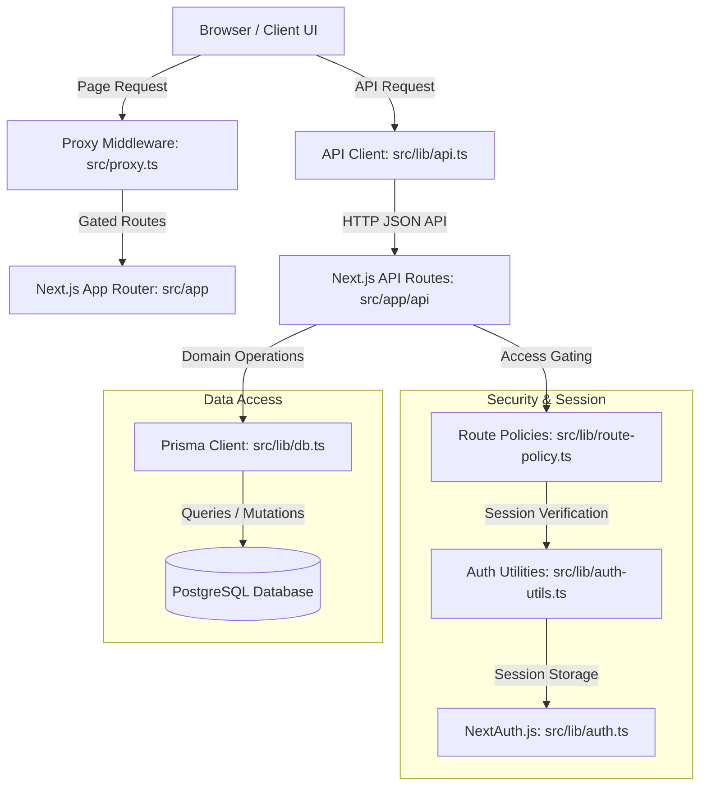

<!-- generated-by: gsd-doc-writer -->
# System Architecture

## System Overview

Renjana LMS is a multi-role legal training platform for Justitia Training Center. The system manages public event/course browsing, course registration and payment flows, gated portals for multiple roles (`ADMIN`, `INSTRUCTOR`, `MANAGER`, `FINANCE`, `LEARNER`), and interactive course progress tracking including quizes, GPS-based attendance, and automated A4 landscape PDF certificate generation. The application is built using a modern full-stack web architecture leveraging Next.js 16 App Router, React 19, TypeScript, Prisma ORM, and PostgreSQL.

## Component Diagram

## Data Flow

A typical request/response flow for a learner completing a lesson follows this path:

1. **Client Interaction**: A learner clicks "Mark as Complete" on a lesson card in the learner dashboard learning interface (`src/app/learn/[courseId]/page.tsx`).
2. **API Call**: The client component invokes the `markLessonComplete` mutation using the API fetch helper (`src/lib/api.ts`), sending a PUT request to `/api/progress`.
3. **API Access Control**: The route handler in `src/app/api/progress/route.ts` intercept the request and calls `requireApiAuthPolicy(req, { roles: ["LEARNER"] })` from `src/lib/route-policy.ts` to verify the user has the required role.
4. **Database Mutation**: Upon successful auth policy validation, the handler runs Prisma queries to update the `Progress` and recalculate the completion percentage for the `Enrollment`.
5. **State Invalidation**: The server returns a success response. The client React Query cache invalidates the progress query key, triggering a UI re-render with updated progress stats.

## Key Abstractions

The following core modules and abstractions define the system's design and access policies:

- **Prisma Client Singleton** (`src/lib/db.ts`): Provides a shared singleton instance of the Prisma Client to optimize database connection reuse.
- **NextAuth Session Config** (`src/lib/auth.ts`): Configures NextAuth.js Credentials provider, managing cookie-based user sessions, password hashing validation with `bcryptjs`, and JWT token payload mapping.
- **RBAC Page Proxy Middleware** (`src/proxy.ts`): Enforces route-level page gating, mapping path prefixes like `/admin`, `/instructor`, `/finance`, and `/dashboard` to required user roles before rendering components.
- **Server Role Gating** (`src/lib/auth-utils.ts`): Exports `getServerUser()`, `requireAuth()`, and `requireRole(...)` server-side helpers to validate active user scopes inside server components and route handlers.
- **Declarative API Policy Enforcer** (`src/lib/route-policy.ts`): Declares `requireApiAuthPolicy(...)` to orchestrate same-origin validation, rate-limiting rules, and role authorization checks in a single function call.
- **Instructor Scoping Query Helper** (`src/lib/instructor-scope.ts`): Evaluates `getInstructorScope(...)` to restrict database queries so instructors can only view learners, classes, and evidence submissions linked to courses they teach.
- **Security Audit Logging** (`src/lib/audit.ts`): Declares `writeSecurityAuditLog(...)` to write security events and administrative actions to the database audit logs.
- **Upload Security Validator** (`src/lib/upload-security.ts`): Validates file uploads by inspecting magic numbers, sizes, and file extensions before permitting storage.

## Directory Structure Rationale

- **`src/app`**: Contains all Next.js App Router files, layout hierarchies, public pages, role dashboards, and API route handlers.
- **`src/components`**: Houses reusable UI primitives (e.g., `src/components/ui`) and feature-specific component trees for role portals (`admin/`, `finance/`, `instructor/`, `learner/`).
- **`src/lib`**: Centralizes shared core services, NextAuth configurations, Prisma database singleton, TypeScript domain definitions, and cross-cutting libraries (rate-limiting, i18n context).
- **`prisma`**: Contains the database schema (`schema.prisma`), migration logs, and test database seeding scripts.
- **`tests`**: Stores Vitest test files targeting API route handlers and domain logic helpers.
- **`docs`**: Main directory containing all architectural, deployment, and developer user guides.
- **`public`**: Serves static asset targets and runtime file uploads (e.g., KTP/payment evidence).
