# PROPOSAL PENAWARAN SISTEM
## **RENJANA LMS: ENTERPRISE LEGAL TRAINING PLATFORM**

**Untuk:** Renjana Training Center  
**Disiapkan oleh:** Antigravity Development Team  
**Tanggal:** 7 Juni 2026  
**Status Dokumen:** Rahasia / Proposal Komersial  

---

## **RINGKASAN EKSEKUTIF**

Renjana Training Center sebagai lembaga pelatihan hukum terkemuka membutuhkan sistem manajemen pembelajaran (LMS) yang tidak hanya mampu mendistribusikan materi, namun juga mengelola administrasi yang ketat—mulai dari verifikasi dokumen pendaftaran, validasi presensi kehadiran di lokasi, hingga penerbitan sertifikat resmi yang sah dan aman dari pemalsuan.

**Renjana LMS** hadir sebagai solusi platform *custom enterprise* yang dirancang khusus untuk memenuhi standar operasional pelatihan hukum profesional. Dikembangkan menggunakan teknologi modern paling andal (**Next.js standalone runtime, React 19, PostgreSQL, dan Docker**), Renjana LMS menawarkan ekosistem multi-peran terintegrasi yang menjamin keamanan data, kemudahan transaksi, dan kenyamanan belajar bagi peserta.

---

## **1. ARSITEKTUR MULTI-PERAN (5 PORTAL TERINTEGRASI)**

Renjana LMS membagi akses secara ketat melalui **Role-Based Access Control (RBAC)** untuk memastikan setiap pengguna bekerja pada ruang lingkup yang aman dan sesuai.

### **A. Portal Peserta (Learner Portal)**
Dirancang dengan antarmuka premium dan modern untuk memaksimalkan motivasi belajar peserta.
- **Continue Learning Card**: Banner dinamis di halaman depan yang memandu peserta langsung ke materi terakhir beserta pesan motivasi berbahasa Indonesia sesuai waktu aktif terakhir.
- **Subway-Style Timeline Map**: Visualisasi jalur pembelajaran interaktif berbentuk peta jalur kereta bawah tanah (subway map). Modul pembelajaran bersifat kolaps otomatis dan hanya membuka modul aktif saat itu untuk menjaga fokus belajar.
- **Sistem Kuis Interaktif**: Kuis bertingkat untuk menguji pemahaman materi sebelum peserta diizinkan melanjutkan ke modul berikutnya.
- **Certificate Center**: Unduh sertifikat kelulusan dalam format Landscape A4 beresolusi tinggi langsung setelah syarat kelulusan terpenuhi.

### **B. Portal Instruktur (Instructor Portal)**
Memudahkan para ahli hukum dan pengajar mengelola penilaian secara efisien.
- **Dashboard Metrik Instruktur**: Statistik ringkasan jumlah peserta bimbingan dan jumlah tugas/bukti belajar (*evidence*) yang perlu dinilai.
- **Scoped Learner Evidence View**: Instruktur hanya dapat melihat, membaca, dan mengunduh berkas bukti belajar dari peserta kelas yang mereka ajar (privasi dan keamanan data terjaga).
- **Grading & Feedback Panel**: Antarmuka terpadu untuk memberikan nilai (rating 1-5) dan komentar umpan balik yang langsung tersimpan ke database dan tampil di dashboard peserta secara *real-time*.

### **C. Portal Keuangan (Finance Portal)**
Memberikan kendali penuh pada arus kas masuk dari pendaftaran pelatihan.
- **Invoice & Transaction List**: Pelacakan status pembayaran pendaftaran pelatihan (Lunas, Menunggu Pembayaran, Kadaluarsa, Gagal).
- **Detail Review Pembayaran**: Pemeriksaan bukti transfer manual atau status pembayaran digital otomatis.
- **Pricing & Refund Management**: Pengelolaan penyesuaian harga khusus dan penanganan retur biaya pelatihan secara tercatat.

### **D. Portal Manajer (Manager Portal)**
Menyediakan data analitis tingkat tinggi untuk kebutuhan pengambilan keputusan manajemen Renjana.
- **Impact & Skill Analytics**: Grafik tren peningkatan keterampilan peserta kualitatif pasca-pelatihan.
- **Risk Analysis Board**: Dasbor untuk mendeteksi risiko ketidaklulusan peserta sejak dini berdasarkan keaktifan kuis dan tugas.
- **Modality Charts**: Visualisasi perbandingan efektivitas kelas mandiri (*self-paced*), hybrid, online, maupun tatap muka (*offline*).

### **E. Portal Admin (Admin Portal)**
Pusat kendali seluruh konfigurasi operasional sistem.
- **Manajemen Event & Kelas**: Pengaturan jadwal pelatihan, kuota, materi pelajaran, kuis, lokasi pelatihan, serta penugasan instruktur ke kelas.
- **Verifikasi Dokumen Pendaftaran**: Fitur bagi admin untuk memeriksa dan menyetujui dokumen prasyarat peserta (KTP, Ijazah, Surat Rekomendasi).
- **Force Certificate Regeneration**: Tombol khusus bagi admin untuk memaksa regenerasi sertifikat PDF peserta jika ada perbaikan nama/gelar tanpa merusak riwayat database asli.

---

## **2. KEUNGGULAN FITUR UNGGULAN & TEKNOLOGI (CODEBASE GROUNDED)**

Sistem Renjana LMS dibangun dengan fitur-fitur spesifik yang telah teruji keandalannya pada level kode program:

### **🛡️ Validasi Kehadiran berbasis GPS (GPS Radius Check-in)**
Peserta tidak bisa memanipulasi kehadiran kelas fisik. Sistem menggunakan **Formula Haversine** di sisi server untuk menghitung jarak koordinat GPS presisi antara ponsel peserta dengan titik lokasi gedung pelatihan yang dikonfigurasi admin. Jika peserta berada di luar radius izin (misal > 100 meter), tombol check-in otomatis terkunci.

### **💳 Otomasi Pembayaran (Midtrans Snap Integration)**
Sistem terintegrasi penuh dengan gateway pembayaran terbesar Indonesia, **Midtrans**. Proses pendaftaran otomatis memicu pembuatan token pembayaran aman (*Secure Token*). Status pembayaran diperbarui secara instan lewat pengolah webhook backend yang aman (*gated webhook parser*).

### **🔒 Gated File Storage & PDF Generator**
Untuk mencegah kebocoran dokumen sensitif (KTP peserta) dan pemalsuan sertifikat:
- File bukti belajar dan sertifikat disimpan di luar direktori publik server (`uploads/`).
- Akses unduhan dikawal ketat oleh API Controller. Hanya pemilik dokumen, instruktur kelas bersangkutan, dan administrator yang dapat mengunduh berkas dengan validasi token.
- Sertifikat dibuat secara dinamis menggunakan **jsPDF** berukuran Landscape A4 standar internasional dengan penomoran unik yang terverifikasi audit log database.

### **⚡ Edge-Runtime Middleware & Next.js 16 Ready**
Sistem menggunakan Next.js 16 terbaru dengan pemisahan modul NextAuth v5 yang aman untuk dijalankan di Edge runtime. Proses otorisasi berjalan super cepat sebelum halaman web dirender ke browser peserta.

---

## **3. GARIS WAKTU IMPLEMENTASI PROYEK (PROJECT TIMELINE)**

Pengembangan dan kustomisasi penuh Renjana LMS diperkirakan memakan waktu **14 minggu (3,5 bulan)** dengan jadwal kerja sebagai berikut:

```mermaid
gantt
    title Jadwal Implementasi Renjana LMS (14 Minggu)
    dateFormat  X
    axisFormat W%W
    
    section Inisiasi & Desain
    Analisis Sistem & Desain Database    :active, des1, 0, 2
    Desain UI/UX & Wireframing           :des2, 2, 4
    
    section Pengembangan Backend (API)
    Integrasi Auth & Manajemen Peran     :api1, 4, 6
    Integrasi Midtrans & Webhook         :api2, 6, 8
    Sistem Absensi GPS & PDF Generator   :api3, 7, 9
    
    section Pengembangan Frontend (UI)
    Dashboard Peserta (Timeline & Card)  :fe1, 6, 9
    Dashboard Instruktur & Penilaian     :fe2, 8, 10
    Dashboard Admin & Keuangan           :fe3, 9, 11
    
    section QA & Peluncuran
    Unit & Integration Testing           :qa1, 10, 12
    User Acceptance Testing (UAT)        :qa2, 12, 13
    Migrasi Data, Setup Docker & Go-Live :qa3, 13, 14
```

- **Minggu 1 - 4 (Fase Desain & Analisis)**: Finalisasi skema database, penentuan parameter validasi koordinat GPS, serta persetujuan *mockup* antarmuka.
- **Minggu 5 - 8 (Fase Backend & Integrasi)**: Integrasi NextAuth, Midtrans API, dan pembatasan keamanan upload file.
- **Minggu 9 - 11 (Fase Frontend & Dashboard)**: Implementasi antarmuka untuk 5 jenis portal pengguna.
- **Minggu 12 - 14 (Fase QA, UAT, & Deployment)**: Pengujian otomatis (170+ test cases), pelatihan operator internal Renjana, dan *deployment* kontainer Docker ke server produksi.

---

## **4. HAK KEPEMILIKAN & LISENSI (SOURCE CODE OWNERSHIP)**

Berbeda dengan sistem berbasis SaaS (Software-as-a-Service) yang mengharuskan pembayaran lisensi bulanan per peserta, model penawaran Renjana LMS adalah **Self-Hosted Custom Enterprise**:
- **Kepemilikan Penuh (*Full Source Code Ownership*)**: Setelah pelunasan proyek selesai, seluruh *source code* (kode program) dan hak kelola database diserahkan penuh kepada Renjana Training Center.
- **Bebas Biaya Berlangganan (*No SaaS Lock-in*)**: Tidak ada biaya lisensi bulanan atau tahunan berdasarkan jumlah peserta. Sistem dapat melayani 100 maupun 10.000+ peserta tanpa ada biaya lisensi tambahan.
- **Fleksibilitas Masa Depan**: Tim IT Renjana Training Center memiliki kebebasan mutlak untuk mengembangkan fitur baru secara mandiri tanpa terikat dengan vendor awal.

---

## **5. SPESIFIKASI MAINTENANCE & SERVICE LEVEL AGREEMENT (SLA)**

Paket pemeliharaan tahunan senilai **Rp 41.250.000/tahun** memberikan jaminan stabilitas sistem dengan parameter kualitas sebagai berikut:

### **A. Respons Kendala Teknis (Support SLA)**
- **Critical Blockers (Server Down/Pembayaran Macet)**: Respons awal dalam **< 2 jam** dengan perbaikan darurat (*hotfix*) langsung diterapkan.
- **Medium Issue (Tampilan Error/Gagal Download Berkas)**: Respons dalam **< 12 jam**, penyelesaian dalam waktu maksimal 24 jam kerja.
- **Minor Issue (Perubahan Teks/Penyesuaian Kecil)**: Respons dalam **< 24 jam**, diselesaikan pada jadwal *maintenance* mingguan.

### **B. Backup & Keamanan**
- **Automated Backup**: Backup database PostgreSQL otomatis setiap hari pukul 02:00 WIB ke Cloud Object Storage terpisah (aman jika server utama bermasalah).
- **Security Patching**: Pemindaian keamanan berkala dan penerapan patch pengaman Docker/Node.js secara rutin setiap akhir bulan (pukul 23:00 - 01:00 WIB guna meminimalisir gangguan pengguna).

---

## **6. ESTIMASI BIAYA & INVESTASI**

| Komponen Proyek | Keterangan | Nilai Investasi (IDR) |
|---|---|---|
| **Lisensi Sistem & Pembuatan (Initial License)** | Pembuatan awal, kustomisasi branding Renjana Training Center, setup 5 portal peran, integrasi Midtrans, dan setup database. | **Rp 275.000.000** |
| **Infrastruktur Cloud (Tahun Ke-1)** | Biaya server VPS App (4 vCPU, 8GB RAM), PostgreSQL Managed DB, Object Storage S3, dan Email Transactional Gateway. | **Rp 24.000.000** |
| **Maintenance & SLA Support (Tahun Ke-1)** | Pemantauan server, backup harian, perbaikan bug, pembaruan versi library keamanan, dan bantuan teknis. | **Rp 41.250.000** |
| **TOTAL TAHUN PERTAMA** | | **Rp 340.250.000** |

*Catatan: Pembayaran Lisensi dapat dilakukan bertahap sesuai kesepakatan termin proyek (Termin I: DP 40%, Termin II: Pengembangan 40%, Termin III: Serah Terima & Go-Live 20%).*

---

## **7. VALUE PROPOSITION (MENGAPA MEMILIH RENJANA LMS)**

1.  **Siap Pakai & Bebas Bug (100% Test Coverage)**: Seluruh modul vital telah diuji dengan **170 test integration otomatis** untuk menjamin tidak ada alur yang macet di tengah jalan saat diakses ribuan peserta secara bersamaan.
2.  **Keamanan Kelas Enterprise**: Penggunaan enkripsi data sensitif, audit log aktivitas admin/keuangan (security audit logging), dan isolasi direktori file menjamin data peserta aman dari serangan siber.
3.  **User Experience Premium**: Tampilan visual yang dinamis, animasi halus, grafik Recharts interaktif, dan performa pemuatan halaman cepat di bawah 1.5 detik (Next.js standalone compiler).
4.  **Tingkat Kustomisasi Tinggi**: Karena sistem ini dikembangkan secara kustom (*custom-built*, bukan plugin CMS instan), Renjana memiliki fleksibilitas penuh untuk menambah fitur baru di masa depan sesuai pertumbuhan bisnis.

---

## **8. PENUTUP & LANGKAH SELANJUTNYA**

Renjana LMS dirancang bukan hanya sebagai aplikasi administrasi biasa, melainkan investasi strategis jangka panjang bagi Renjana Training Center untuk memperkuat posisinya sebagai lembaga pendidikan hukum terpercaya. Dengan sistem yang tangguh, teruji otomatis (100% test coverage), aman dari kebocoran berkas, serta absensi berbasis lokasi GPS yang ketat, platform ini akan memberikan efisiensi luar biasa bagi instruktur, tim keuangan, manajer, dan kenyamanan maksimal bagi para peserta belajar.

Kami sangat menghargai kesempatan yang diberikan untuk mengajukan penawaran kerja sama ini. Kami yakin kemitraan ini akan melahirkan solusi digital terbaik yang mendorong kemajuan pendidikan hukum di Indonesia.

### **Langkah Selanjutnya (Next Steps):**
1. **Persetujuan & Negosiasi**: Pembahasan kesepakatan komersial dan jadwal kickoff proyek.
2. **Penandatanganan Kontrak (PKS)**: Penyusunan Perjanjian Kerja Sama formal.
3. **Kickoff Meeting & Analisis Kebutuhan**: Pertemuan awal untuk menyelaraskan detail kustomisasi branding dan skema pendaftaran.

### **Lembar Persetujuan (Sign-off Block):**

Untuk melanjutkan proyek, perwakilan resmi dapat menandatangani dokumen persetujuan ini:

| Disiapkan oleh, | Disetujui oleh, |
|:---:|:---:|
|    **Antigravity Development Team** |    **Renjana Training Center** |
| Tanggal: 7 Juni 2026 | Tanggal: ___________________ |
